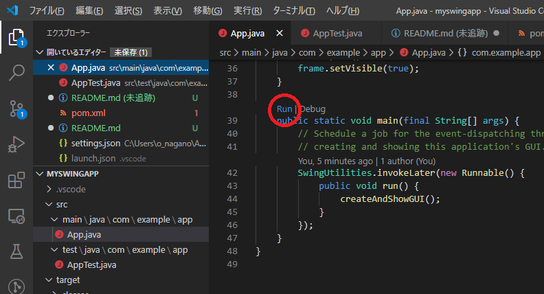

サンプル Swing アプリケーション
==================

実行方法
----------

1. コマンドラインでリポジトリをクローン (swing-application という名前のフォルダができる)

```cmd
git clone https://github.com/chameleonhead/swing-application.git
```

2. クローンしたフォルダに移動

```cmd
cd swing-application
```

3. Visual Studio Code で開く

```cmd
code .
```

4. src/main/java/com/example/app/App.java を開く (Visual Studio Code で)

5. main メソッドの上部にある RUN を押す

